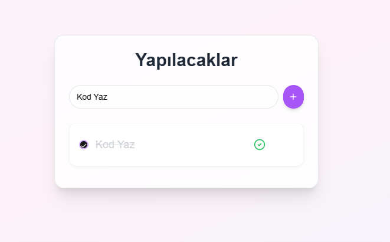

# Baz Basic Todo App
Baz Basic Todo App is a simple and intuitive task management tool designed to help you stay organized and productive.
With its user-friendly interface and smooth functionality, it’s perfect for managing daily tasks efficiently.

## Features

- Add Todo: Quickly add tasks to your list with ease.
- Delete Todo: Remove tasks you no longer need with a single click.
- Toggle Todo: Mark tasks as completed or incomplete effortlessly.
- Save Todos to Local Storage: Keep your tasks saved locally, even when you close the app.
- Load Todos from Local Storage: Automatically reload your tasks when you revisit the app.

## Screenshots



## Technologies

- React: For building a dynamic and responsive user interface.
- Tailwind: For seamless and modern styling.
- Lucide: For clean and visually appealing icons.
- Framer Motion: For fluid and engaging animations.
- Local Storage: For persistent task management.

## Installation

- Clone the repository and install dependencies:

```bash
npm install
```

## Usage
Run the app locally:
```bash
npm run dev
```

Stay on top of your tasks with Baz Basic Todo App – your simple solution to task management!
